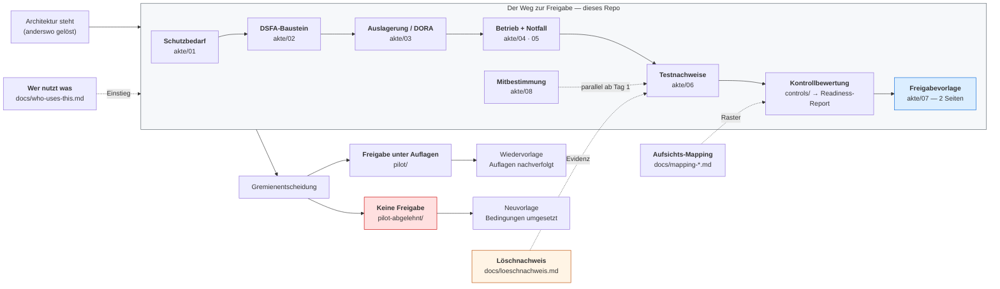

# From Architecture to Approval — RAG in BaFin-regulated organizations

> ## Everyone shows you how to build compliant RAG. This repo shows you how to get it approved.

The approval file, the control catalogue with written-out audit procedures, the erasure-proof
protocol, and two fictional banks taken end to end through the process — one approved under
conditions, one refused — from information security, data protection and the 2nd line to the
board submission.

**The approval artifacts are in German**, because German supervisory practice is the gap this
repository fills. An [English executive summary](docs/executive-summary.en.md) is provided.

[](LICENSE)
[](LICENSE-docs)

---

## What exists — and what was missing

Honest positioning, with links, because these are good pieces of work and this repository builds
on them rather than against them:

| What already exists | Examples |
|---|---|
| **RAG security patterns with code and tests** — identity-scoped retrieval, OWASP-LLM filters, guardrails | e.g. [OWASP Top 10 for LLM Applications](https://owasp.org/www-project-top-10-for-large-language-model-applications/), [NVIDIA NeMo Guardrails](https://github.com/NVIDIA/NeMo-Guardrails), [Microsoft Presidio](https://github.com/microsoft/presidio) for PII handling |
| **Vendor blueprints** — policy engines, encryption, DLP, reference deployments | the major cloud and platform vendors' secure-RAG architectures |
| **Generic framework mappings** — GDPR, NIST AI RMF, ISO/IEC 42001 | e.g. [NIST AI RMF](https://www.nist.gov/itl/ai-risk-management-framework) and the mappings built on it |
| **Reference-architecture write-ups** | plentiful, and often good |

**What did not exist anywhere:** the path from a finished architecture to **formal sign-off in a
BaFin-regulated institution** — through the 2nd line of defence, information security, data
protection and internal audit, up to the board submission. No approval file. No written-out audit
procedures. No worked case.

That is the only thing in here. Everything above is referenced as an **implementation option**;
none of it is reproduced.

## Where each artifact bites



## The artifacts

| Artifact | One sentence | Sprache |
|---|---|---|
| **[Freigabeakte](akte/)** — `01`–`08` | The eight templates an institution actually needs, each naming the actor who uses it, what the reviewing function typically asks, and its open questions. | Deutsch |
| **[Kontrollkatalog](controls/controls.md)** | 23 controls, each with control objective, a written-out **Prüfhandlung**, the **evidence artifact**, and the supervisory mapping — generated from [`controls.yaml`](controls/controls.yaml). | Deutsch |
| **[Löschnachweis](docs/loeschnachweis.md)** | Erasure as a chain across eight stations, with three separate verification steps for the vector index — because the functional test is green even when nothing was physically removed. | Deutsch |
| **[Aufsichts-Mapping](docs/mapping-bait-vait-dora.md)** | Requirement → control → evidence, against what actually applies today (DORA, MaRisk) with BAIT/VAIT kept only as the vocabulary audit functions still speak. | Deutsch |
| **[Zielgruppen-Matrix](docs/who-uses-this.md)** | Ten actors, their process, their artifact, their opening question. | DE/EN |
| **[Pilot](pilot/)** | One fictional bank taken end to end — two red controls, one documented conflict, approval under four conditions. | Deutsch |
| **[Zweiter Pilot](pilot-abgelehnt/)** | The counter-case: a customer-facing assistant that gets **no approval** — eight red controls, and how to write a defensible No with a path to Yes. | Deutsch |
| **[Quellen](docs/quellen.md)** | Every citation in this repository with its verification status and retrieval date — including the ones that could not be verified. | Deutsch |
| **[Executive summary](docs/executive-summary.en.md)** | The whole thing, for international readers. | English |

### ▶ Start with the pilot

Do not start with the templates. Start with the worked case — about **five minutes**:

1. [`pilot/00-fallbeschreibung.md`](pilot/00-fallbeschreibung.md) — the fictional Nordwind Bank
   AG, the system, the people, the nine-month timeline, and the conflict.
2. [`pilot/07-freigabevorlage-final.md`](pilot/07-freigabevorlage-final.md) — the two-page paper
   that actually went to the board.

Then open the templates. They read completely differently once you have seen where they end up.

And when you need the harder case — the project that should not be approved — read
[`pilot-abgelehnt/`](pilot-abgelehnt/). It shows how to write a No that is verifiable rather than
personal, and why a No without a path to Yes is just a block.

## Quickstart

```bash
git clone https://github.com/leonkoellerwirth-arch/rag-approval-blueprint.git
cd rag-approval-blueprint

# 1. Copy the approval file into your own project and fill it in
cp -r akte/ ../my-rag-project/freigabeakte/

# 2. Render the control catalogue (your 2nd line's test grid)
./setup.sh
python tools/render_controls.py catalogue

# 3. Record your control assessment in a YAML file, then render the readiness report
cp pilot/controls-assessment.yaml my-assessment.yaml   # edit statuses, findings, Auflagen
python tools/render_controls.py readiness --assessment my-assessment.yaml
```

The renderer is the only code in here: 249 lines, tested, ruff-clean.
`controls/controls.yaml` is the single source of truth — the Markdown is generated, and a test
fails if the two ever drift.

## What this deliberately is not

- **Not another reference architecture.** One context diagram, above, so the artifacts have a
  place. That is all. See [ADR 0001](docs/adr/0001-genehmigung-statt-architektur.md).
- **Not a filter or security library.** Those exist and are good; they are linked above.
- **Not US-framework depth.** HIPAA, FERPA and similar are out of scope by one line.
- **Not legal advice.** See [`DISCLAIMER.md`](DISCLAIMER.md).

## Who wrote this, and why that matters here

**Leon Köllerwirth Hlihel** — interim IT leader and principal consultant for AI governance and
enterprise architecture in regulated environments. As Head of Information Security in a
BaFin-supervised environment, he sat on the **approving** side: working with the 2nd line and
internal audit, in MaRisk/BAIT practice, on the receiving end of exactly the submissions this
repository prepares.

That perspective is the content here — not documents. Every template was written from scratch
from generic supervisory logic; **no client, employer or engagement material appears anywhere**,
and the pilot institution is fictional.

## Honest scope, and open questions

A reference pattern, not a framework, and not a compliance product. Known limitations, stated
plainly:

- **Not legal advice, not a certification.** Whether an obligation applies to your institution
  depends on its form, size, business model and supervisory classification.
- **BAIT chapter names could not be verified against the original circular** (the BaFin PDF was
  not machine-readable). They are marked as an orientation aid, not a citation — see
  [`docs/quellen.md`](docs/quellen.md).
- **The 9th MaRisk amendment (June 2026) is not incorporated**; its circular number and entry
  into force could not be confirmed. All MaRisk references are to Circular 06/2024.
- **The EU AI Act is deliberately not mapped.** General application starts 2 August 2026, and
  whether an internal policy assistant is high-risk is a case-by-case Annex III test. A plausible
  guess would be more dangerous than an open gap.
- **The ghost-vectors paper is new** (June 2026); peer-review status and follow-up work are
  unknown. Treated as a strong pointer to a question, not a settled result.
- **Personalvertretungsrecht is out of scope.** The co-determination building block
  ([`akte/08`](akte/08-mitbestimmung-betriebsvereinbarung.md)) cites the BetrVG only. For
  public-law institutions — Sparkassen, Landesbanken, Anstalten — the federal and state staff
  representation acts apply instead; their provisions differ per state and are not worked up here.
- **No case where the committee overrules its own control functions.** Both pilots show a
  committee that follows the recommendation. The harder case is sketched in
  [`pilot-abgelehnt/`](pilot-abgelehnt/07-freigabevorlage-final.md) but not worked out.
- **Every document ends with its own "Offene Punkte".** That is the method, not an omission.

Feedback, corrections and — especially — reports of a wrong citation are welcome as issues.

## License

Dual-licensed: **code** (`tools/`, `tests/`, `scripts/`) under the [MIT License](LICENSE);
**documents and approval artifacts** (`akte/`, `pilot/`, `controls/`, `docs/`, this README) under
[CC BY 4.0](LICENSE-docs). Filling the templates in inside your own organization does not oblige
you to publish anything.

## Author

**Leon Köllerwirth Hlihel**
[leon-koellerwirth.com](https://leon-koellerwirth.com) ·
[LinkedIn](https://www.linkedin.com/in/leon-k%C3%B6llerwirth-hlihel-642506197/) ·
Sister repository: [agentic-ai-governance-toolkit](https://github.com/leonkoellerwirth-arch/agentic-ai-governance-toolkit)
— lifecycle models, risk scoring, EU AI Act & DORA checklists, and a working evaluator.
