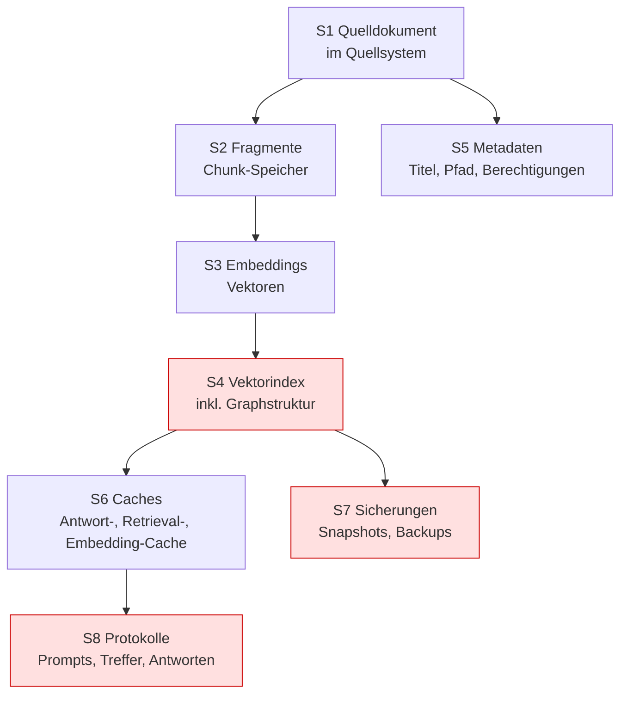

# Löschnachweis-Protokoll für RAG-Systeme

> **Wer benutzt dieses Dokument?** Informationssicherheit und Datenschutz gemeinsam mit dem
> IT-Betrieb.
> **In welchem Prozess?** Umsetzung von Löschverlangen (Art. 17 DSGVO), Aufbewahrungs- und
> Löschkonzept, Nachweisführung gegenüber der Prüfung.
> **Wer prüft es?** 2nd Line und interne Revision — über die Kontrollen `LOE-01` bis `LOE-04`
> des [Kontrollkatalogs](../controls/controls.md).

> **Kein Rechtsrat.** Dieses Dokument ist ein Arbeitsmittel aus generischer Aufsichts- und
> Governance-Logik, keine Rechts- oder Datenschutzberatung. Siehe [`DISCLAIMER.md`](../DISCLAIMER.md).

---

## Die These

**Ein Löschversprechen ist kein Löschnachweis.** In einem klassischen System ist Löschen ein
Vorgang: Der Datensatz ist weg. In einem RAG-System ist Löschen das Auflösen einer
Ableitungskette — und die unangenehme Eigenschaft dieser Kette ist, dass ihre mittleren Glieder
nicht wie Kopien der Daten aussehen. Ein Vektor ist kein Text. Ein soft-gelöschter Indexeintrag
ist nicht sichtbar. Ein Cache ist niemandes Zuständigkeit. Genau deshalb ist die Löschung die
Stelle, an der eine sonst saubere Freigabeakte in der Prüfung aufreißt.

Dieses Dokument macht aus dem Versprechen ein Verfahren: die Kette, die Verifikationsschritte je
Station und ein Protokolltemplate, das als Evidenz taugt.

## Der Forschungsanschluss: Ghost Vectors

Die praktische Relevanz lässt sich nicht mehr mit „theoretisch denkbar" abtun. In der Arbeit

> **Ghost Vectors: Soft-Deleted Embeddings Remain Reconstructible in HNSW Vector Databases.**
> Chandranil Chakraborttii, Jackeline García Alvarado, Sitora Abdulofizova, Shivanshu Dwivedi.
> arXiv:2606.18497, eingereicht am 16.06.2026. <https://arxiv.org/abs/2606.18497>
> *(Fundstelle geprüft im Juli 2026.)*

zeigen die Autoren, dass über die Lösch-API entfernte Einträge in verbreiteten
HNSW-Implementierungen physisch in den Indexdateien verbleiben und **auf der Speicherebene unter
Umgehung der API wiederhergestellt** werden können. Aus den so gewonnenen Vektoren ließen sich
mit einem Inversionsmodell personenbezogene Inhalte in erheblichem Umfang rekonstruieren — in
den berichteten Versuchen unter anderem ein Viertel der exakten Personennamen und knapp die
Hälfte der geografischen Angaben aus einem biografischen Datensatz. Als Gegenmaßnahme
beschreiben die Autoren **Epoch Key Rotation**: Vektoren werden verschlüsselt gespeichert und
beim Löschen wird der zugehörige Schlüssel verworfen, womit die beobachtete Wiederherstellung
auf null fiel.

**Was daraus für die Freigabe folgt — und was nicht.**

- **Folgt:** Die Aussage „gelöscht" darf sich nicht auf einen API-Aufruf stützen. Sie braucht
  eine Aussage darüber, was auf der Ebene der Indexdatei geschieht, und einen Nachweis dafür.
- **Folgt:** Löschung muss *verifizierbar* und *unumkehrbar* sein — zwei getrennte
  Eigenschaften, die getrennt zu belegen sind.
- **Folgt nicht:** Dass Ihr Vektorindex unsicher ist. Verfahren, Implementierung und Betriebsart
  unterscheiden sich; prüfen Sie Ihre eigene Konstellation, statt ein Ergebnis zu übertragen.
- **Folgt nicht:** Dass Krypto-Shredding die einzige Lösung ist. Es ist ein sauberes Muster,
  aber ein zeitnaher Neuaufbau oder eine erzwungene Kompaktierung des Index können je nach
  Größenordnung ebenso tragen.

*Das Papier ist neu; behandeln Sie es als starken Hinweis auf eine Fragestellung, nicht als
abschließenden Stand. Prüfen Sie vor Verwendung in einer echten Vorlage, ob eine begutachtete
Fassung oder Folgearbeiten vorliegen.*

## Die Ableitungskette

Ein einziges Quelldokument erzeugt in einem RAG-System typischerweise Spuren an acht Stationen.
Ein Löschkonzept, das weniger als diese acht benennt, ist unvollständig.

*Rot markiert sind die drei Stationen, an denen Löschkonzepte in der Praxis am häufigsten
scheitern: der Index selbst, die Sicherungen und die Protokolle.*

## Verifikationsschritte je Station

Für jede Station: was gelöscht wird, wie es verifiziert wird, und was als Evidenz taugt.

### S1 — Quelldokument

| | |
|---|---|
| **Löschhandlung** | Löschung im führenden Quellsystem nach dessen Verfahren |
| **Verifikation** | Dokument über das Quellsystem nicht mehr auffindbar |
| **Evidenz** | Löschbestätigung des Quellsystems mit Zeitstempel |
| **Fallstrick** | Das Quellsystem hat einen eigenen Papierkorb mit eigener Frist — die Kette beginnt erst nach dessen Ablauf wirklich |

### S2 — Fragmente (Chunks)

| | |
|---|---|
| **Löschhandlung** | Entfernung aller Fragmente mit der Dokument-ID aus dem Chunk-Speicher |
| **Verifikation** | Abfrage nach der Dokument-ID liefert null Treffer; Gesamtzahl der Fragmente ist um die erwartete Anzahl gesunken |
| **Evidenz** | Abfrageergebnis vor und nach der Löschung, mit Zählwerten |
| **Fallstrick** | Fragmente ohne saubere Rückverknüpfung zur Quelle sind nicht adressierbar — dann ist die Löschung nicht durchführbar, nicht nur nicht nachweisbar |

### S3/S4 — Embeddings und Vektorindex *(die kritische Station)*

| | |
|---|---|
| **Löschhandlung** | Entfernung der Vektoren **und** Auflösung ihrer Repräsentation in der Indexstruktur |
| **Verifikation** | Dreistufig, siehe unten |
| **Evidenz** | Negativ-Retrieval-Protokoll, Index-Inspektionsnachweis, Nachweis über Kompaktierung/Neuaufbau bzw. Schlüsselvernichtung |
| **Fallstrick** | Die Lösch-API setzt eine Markierung; die Vektoren bleiben in der Datei |

**V1 — Negativ-Retrieval-Test (funktional).** Formulieren Sie vor der Löschung `<3–5>` Anfragen,
die das Dokument zuverlässig treffen, und halten Sie die Ergebnisse fest. Wiederholen Sie exakt
dieselben Anfragen nach der Löschung. Bestanden, wenn keine Anfrage mehr Inhalte, Fundstellen
oder Titel des Dokuments liefert. *Notwendig, aber nicht hinreichend — dieser Test prüft die
API-Ebene, also genau die Ebene, die eine Markierung bereits zufriedenstellt.*

**V2 — Index-Inspektion (physisch).** Prüfen Sie auf der Ebene unterhalb der API. Je nach
Konstellation: Anzahl der Elemente im Index vor und nach der Löschung; Anteil markierter, aber
nicht entfernter Einträge; Größe der Indexdateien; bei Verfahren mit Kompaktierung, ob und wann
diese läuft. Belegen Sie mit einer Zahl, nicht mit einer Zusicherung. *Bei einem
SaaS-Vektordienst ist diese Ebene für Sie regelmäßig nicht einsehbar. Dann ist die ehrliche
Antwort: schriftliche Auskunft des Anbieters einholen, Aussage in die Auslagerungsbewertung
([`../akte/03-auslagerung-drittparteien.md`](../akte/03-auslagerung-drittparteien.md)) aufnehmen
und die verbleibende Unsicherheit als Restrisiko in die Freigabevorlage schreiben.*

**V3 — Unumkehrbarkeit.** Belegen Sie, dass die Daten nicht wiederherstellbar sind. Tragfähige
Muster:

| Muster | Vorgehen | Nachweis | Geeignet, wenn |
|---|---|---|---|
| Erzwungene Kompaktierung | Kompaktierung nach Löschung auslösen | Protokoll der Kompaktierung, Größenvergleich | Das Verfahren die Kompaktierung anbietet |
| Neuaufbau des Index | Index aus den verbliebenen freigegebenen Quellen neu erzeugen | Aufbauprotokoll mit Zeitstempel und Quellenliste | Der Index klein genug für regelmäßigen Neuaufbau ist |
| **Krypto-Shredding / Epoch Key Rotation** | Vektoren verschlüsselt ablegen, beim Löschen den Schlüssel vernichten | Protokoll der Schlüsselvernichtung; Nachweis, dass kein Backup des Schlüssels existiert | Löschungen häufig sind und ein Neuaufbau zu teuer ist |

*Krypto-Shredding verschiebt das Problem auf das Schlüsselmanagement — es löst es nur, wenn
wirklich kein Schlüsselbackup existiert. Prüfen Sie das ausdrücklich; ein Schlüssel in einem
regelmäßig gesicherten Tresor macht das Verfahren wirkungslos.*

### S5 — Metadaten

| | |
|---|---|
| **Löschhandlung** | Entfernung von Titel, Pfad, Autor, Berechtigungsangaben |
| **Verifikation** | Suche nach dem Dokumenttitel liefert keinen Treffer, auch nicht als Fundstellenangabe |
| **Evidenz** | Abfrageergebnis nach Titel und Dokument-ID |
| **Fallstrick** | Metadaten liegen oft in einer getrennten Tabelle und werden vom Löschlauf des Vektorindex nicht erfasst — der Titel bleibt als Fundstelle sichtbar |

### S6 — Caches

| | |
|---|---|
| **Löschhandlung** | Invalidierung von Antwort-, Retrieval- und Embedding-Caches |
| **Verifikation** | Zuvor gestellte, gecachte Anfrage wiederholen und prüfen, ob eine neue Antwort erzeugt wird |
| **Evidenz** | Cache-Protokoll oder Vergleich der Antwortzeiten/Antwortinhalte vor und nach |
| **Fallstrick** | Der wirksamste Cache ist der, den niemand als Datenspeicher betrachtet |

### S7 — Sicherungen

| | |
|---|---|
| **Löschhandlung** | Regelmäßig keine — Sicherungen werden nicht selektiv bearbeitet |
| **Verifikation** | Nachweis, dass die Löschung nach einer Wiederherstellung **erneut angewendet** wird |
| **Evidenz** | Wiederanlaufplan mit Prüfschritt Löschabgleich; Protokoll des letzten Restore |
| **Fallstrick** | Ein Restore ist bei RAG ein datenschutzrelevanter Vorgang, kein rein technischer |

*Der übliche und vertretbare Weg: Löschverlangen werden mit Zeitstempel in einer Löschliste
geführt; nach jeder Wiederherstellung wird die Liste erneut angewendet, bevor das System
freigegeben wird. Halten Sie die Aufbewahrungsfrist der Sicherungen fest — sie begrenzt, wie
lange dieser Nachlauf nötig ist.*

### S8 — Protokolle

| | |
|---|---|
| **Löschhandlung** | Löschung nach Ablauf der Aufbewahrungsfrist; ggf. gezielte Entfernung von Antwortinhalten |
| **Verifikation** | Ältester Protokolleintrag liegt innerhalb der Frist |
| **Evidenz** | Abfrage des ältesten Eintrags; Löschkonzept mit Fristbegründung |
| **Fallstrick** | Antworten im Protokoll enthalten wörtliche Auszüge des gelöschten Dokuments — die Löschung an S1–S6 lässt den Inhalt an S8 unberührt |

**Der ehrliche Zielkonflikt.** *Protokolle dienen der Nachvollziehbarkeit — und enthalten genau
deshalb Inhalte, die gelöscht werden sollen. Beide Anforderungen sind berechtigt. Lösen Sie den
Konflikt bewusst und dokumentiert: kurze Aufbewahrungsfrist, Protokollierung von Fundstellen
statt Volltexten, oder getrennte Fristen für Metadaten und Inhalte. Was nicht trägt, ist, den
Konflikt nicht zu erwähnen.*

## Löschprotokoll (Template)

Dieses Protokoll ist das Evidenz-Artefakt für die Kontrollen `LOE-01` und `LOE-02`. Führen Sie es
je Löschvorgang.

---

### Löschprotokoll Nr. `<lfd. Nr.>`

| Feld | Inhalt |
|---|---|
| Auslöser | `<Betroffenenverlangen (Art. 17 DSGVO) / Ablauf Aufbewahrungsfrist / Rückzug einer Richtlinie / Entzug einer Quellfreigabe>` |
| Eingang am | `<TT.MM.JJJJ>` |
| Frist | `<TT.MM.JJJJ>` |
| Gegenstand | `<Dokument-ID(s), Titel, Umfang>` |
| Betroffene Personen | `<falls einschlägig>` |
| Verantwortlich | `<Name, Rolle>` |
| Systemstand | `<Anwendungs-, Embedding-Modell-, Indexversion>` |

| Station | Löschhandlung | Durchgeführt am | Durch | Verifikation | Ergebnis | Evidenz |
|---|---|---|---|---|---|---|
| S1 Quelle | `<…>` | `<…>` | `<…>` | `<…>` | `<ok/offen>` | `<Referenz>` |
| S2 Fragmente | `<…>` | `<…>` | `<…>` | Trefferzahl vor/nach | `<…>` | `<…>` |
| S3/S4 Vektoren + Index | `<…>` | `<…>` | `<…>` | V1 / V2 / V3 | `<…>` | `<…>` |
| S5 Metadaten | `<…>` | `<…>` | `<…>` | Titelsuche | `<…>` | `<…>` |
| S6 Caches | `<…>` | `<…>` | `<…>` | Wiederholte Anfrage | `<…>` | `<…>` |
| S7 Sicherungen | Löschliste ergänzt | `<…>` | `<…>` | Eintrag in Löschliste | `<…>` | `<…>` |
| S8 Protokolle | `<…>` | `<…>` | `<…>` | Ältester Eintrag | `<…>` | `<…>` |

**Negativ-Retrieval-Test (V1)**

| # | Anfrage | Ergebnis vor Löschung | Ergebnis nach Löschung |
|---|---|---|---|
| 1 | `<Wortlaut>` | `<Treffer, Fundstelle>` | `<kein Treffer>` |
| 2 | `<…>` | `<…>` | `<…>` |
| 3 | `<…>` | `<…>` | `<…>` |

**Index-Inspektion (V2).** Elementanzahl vorher/nachher: `<…>` · markierte, nicht entfernte
Einträge: `<…>` · Dateigröße vorher/nachher: `<…>` · Bemerkung: `<…>`

**Unumkehrbarkeit (V3).** Gewähltes Muster: `<Kompaktierung / Neuaufbau / Krypto-Shredding>` ·
durchgeführt am: `<…>` · Nachweis: `<…>` · Bestätigung, dass kein Schlüssel-/Datenbackup den
Vorgang unterläuft: `<…>`

**Abschluss.** Vollständig vollzogen am `<TT.MM.JJJJ>` · bestätigt durch `<Rolle>` ·
Rückmeldung an betroffene Person am `<TT.MM.JJJJ>` · verbleibende Einschränkungen: `<…>`

---

## Umsetzung in fünf Schritten

1. **Kette aufnehmen.** Zeichnen Sie die acht Stationen für *Ihre* Architektur und benennen Sie
   je Station das System und die verantwortliche Rolle. Was Sie nicht benennen können, ist Ihre
   erste Lücke.
2. **Adressierbarkeit sicherstellen.** Jedes Fragment und jeder Vektor braucht eine
   Rückverknüpfung zur Quelle. Ohne sie ist gezielte Löschung technisch unmöglich — das ist eine
   Architekturentscheidung, keine Betriebsfrage, und sie muss vor dem Bau getroffen werden.
3. **Unumkehrbarkeitsmuster wählen.** Kompaktierung, Neuaufbau oder Krypto-Shredding — mit
   Begründung und Kostenabschätzung.
4. **Einmal vollständig durchspielen.** Vor der Freigabe an einem echten Dokument, mit
   vollständigem Protokoll. Das erste Protokoll ist zugleich der Nachweis, dass das Verfahren
   funktioniert.
5. **Wiederkehrend prüfen.** Die Löschprüfung gehört in den Turnus der 2nd Line und in die
   Prüfschritte nach jedem Wiederanlauf.

## Offene Punkte

- Die Ghost-Vectors-Arbeit (arXiv:2606.18497, Juni 2026) ist neu; ein Begutachtungsstand oder
  Folgearbeiten waren beim Erstellen dieses Dokuments nicht bekannt. Vor Verwendung in einer
  echten Vorlage aktualisieren.
- Die berichteten Rekonstruktionsraten stammen aus den Versuchsaufbauten der Autoren mit
  bestimmten Datensätzen und einem Inversionsmodell. Sie sind nicht ohne Weiteres auf einen
  Korpus interner Richtlinien übertragbar; eine eigene Abschätzung ist nicht Teil dieses
  Repositories.
- Für verbreitete verwaltete Vektordienste liegt keine geprüfte Aussage vor, ob und wann eine
  physische Entfernung gelöschter Einträge stattfindet. Dies ist beim jeweiligen Anbieter
  schriftlich zu erfragen; hier wird bewusst keine Anbieteraussage wiedergegeben.
- Ob Embeddings personenbezogene Daten sind, wird in diesem Repository als Bewertungsfrage
  behandelt und nicht abschließend beantwortet; siehe
  [`../akte/02-dsfa-baustein-rag.md`](../akte/02-dsfa-baustein-rag.md), Abschnitt 3.
- Die Wechselwirkung zwischen Löschpflichten und aufsichtlichen Aufbewahrungspflichten ist hier
  nur als Zielkonflikt benannt, nicht ausgearbeitet.
